<div align="center">

</div>

<div align="center">
<h2> 50% Smaller, Faster Stable Diffusion 🚀 </h2>
</div>

<div align="center">
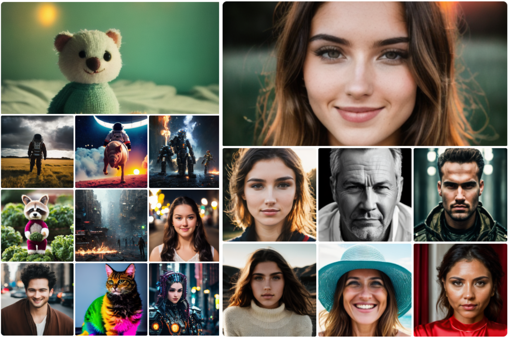
</div>


Knowledge-distilled, smaller versions of Stable Diffusion. Unofficial implementation as described in [BK-SDM](https://arxiv.org/abs/2305.15798).<br>
These distillation-trained models produce images of similar quality to the full-sized Stable-Diffusion model while being significantly faster and smaller.<br>
## Components of this Repository:
+ **[data.py](/data.py)** contains scripts to download data for training. 
+ **[distill_training.py](/distill_training.py)** trains the U-net using the methods described in the paper. This might need additional configuration depending on what model type you want to train (sd_small/sd_tiny),batch size, hyperparameters etc. 
The basic training code was sourced from the [Huggingface 🤗 diffusers library](https://github.com/huggingface/diffusers).<br>
LoRA Training and Training from checkpoints can be done by simply using the standard diffusers scripts.

## Training Details:
Knowledge-Distillation training a neural network is akin to a teacher guiding a student step-by-step (a somewhat loose example). A large teacher model is trained on large amounts of data and then a smaller model is trained on a smaller dataset, with the objective of aping the outputs of the larger model along with classical training on the dataset.<br>
For the Knowledge-Distillation training, we used [SG161222/Realistic_Vision_V4.0's](SG161222/Realistic_Vision_V4.0) U-net  as the teacher model with a subset of [recastai/LAION-art-EN-improved-captions](https://huggingface.co/datasets/recastai/LAION-art-EN-improved-captions) as training data.<br> 

The final training loss is the sum of the MSE loss between the noise predicted by the teacher U-net and the noise predicted by the student U-net, the MSE Loss between the actual added noise and the predicted noise, and the sum of MSE Losses between the predictions of the teacher and student U-nets after every block.<br>
Total Loss:<br>
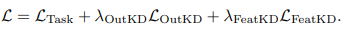<br>
Task Loss (i.e MSE Loss between added noise and actual noise):<br>
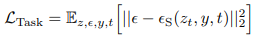<br>
Knowledge Distillation Output Loss (i.e MSE Loss between final output of teacher U-net and student U-net):<br>
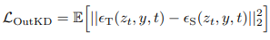<br>
Feature-level Knowledge Distillation Loss (i.e MSE Loss between outputs of each block in the U-net):<br>
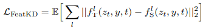<br>

Here are the settings we used for training:<br>
```python
lr = 1e-5
scheduler = "cosine"
batch_size = 32
output_weight = 0.5 # Lambda Out in the final loss equation
feature_weight = 0.5 # Lambda Feat in the final loss equation
```

## Parameters:

Normal Stable Diffusion U-net:<br>
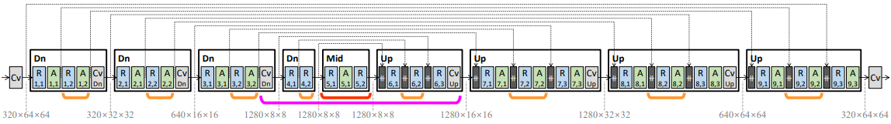
Number of parameters: 859,520,964<br>

SD_Small U-net:<br>
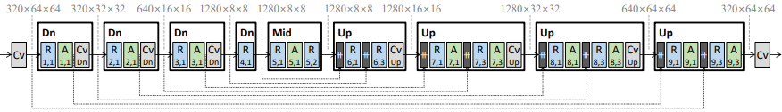<br>
Number of parameters: 579,384,964<br>

SD_Tiny U-net:<br>
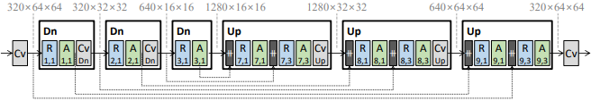<br>
Number of parameters: 323,384,964<br>

(Model parameters reported using torchinfo)


## Usage 
```python
import torch
from diffusers import DiffusionPipeline
from diffusers import DPMSolverMultistepScheduler
from torch import Generator


path = 'segmind/small-sd' # Path to the appropriate model-type
# Insert your prompt below.
prompt = "Faceshot Portrait of pretty young (18-year-old) Caucasian wearing a high neck sweater, (masterpiece, extremely detailed skin, photorealistic, heavy shadow, dramatic and cinematic lighting, key light, fill light), sharp focus, BREAK epicrealism"
# Insert negative prompt below. We recommend using this negative prompt for best results.
negative_prompt = "(deformed iris, deformed pupils, semi-realistic, cgi, 3d, render, sketch, cartoon, drawing, anime:1.4), text, close up, cropped, out of frame, worst quality, low quality, jpeg artifacts, ugly, duplicate, morbid, mutilated, extra fingers, mutated hands, poorly drawn hands, poorly drawn face, mutation, deformed, blurry, dehydrated, bad anatomy, bad proportions, extra limbs, cloned face, disfigured, gross proportions, malformed limbs, missing arms, missing legs, extra arms, extra legs, fused fingers, too many fingers, long neck" 

torch.set_grad_enabled(False)
torch.backends.cudnn.benchmark = True

# Below code will run on gpu, please pass cpu everywhere as the device and set 'dtype' to torch.float32 for cpu inference.
with torch.inference_mode():
    gen = Generator("cuda")
    gen.manual_seed(1674753452)
    pipe = DiffusionPipeline.from_pretrained(path, torch_dtype=torch.float16, safety_checker=None, requires_safety_checker=False)
    pipe.to('cuda')
    pipe.scheduler = DPMSolverMultistepScheduler.from_config(pipe.scheduler.config)
    pipe.unet.to(device='cuda', dtype=torch.float16, memory_format=torch.channels_last)

    img = pipe(prompt=prompt,negative_prompt=negative_prompt, width=512, height=512, num_inference_steps=25, guidance_scale = 7, num_images_per_prompt=1, generator = gen).images[0]
    img.save("image.png")
```
## Training the Model:
Training instructions for knowledge distillation are similar to those of the diffusers text-to-image finetuning script, apart from some extra parameters:<br>
```--distill_level```: One of "sd_small" or "sd_tiny", depending on which type of model is to be trained.<br>
```--output_weight```: A floating point number representing the amount the output-level KD loss is to be scaled by.<br>
```--feature-weight```: A floating point number representing the amount the feautre-level KD loss is to be scaled by.<br>
Also, ```snr_gamma``` has been removed.
We suggest using a standard Stable Diffusion model to distillation train, since the script has been configured for those architectures.

An example:<br>
```python
export MODEL_NAME="SG161222/Realistic_Vision_V4.0"
export DATASET_NAME="fantasyfish/laion-art"

accelerate launch --mixed_precision="fp16"  distill_training.py \
  --pretrained_model_name_or_path=$MODEL_NAME \
  --dataset_name=$DATASET_NAME \
  --use_ema \
  --resolution=512 --center_crop --random_flip \
  --train_batch_size=1 \
  --gradient_accumulation_steps=4 \
  --gradient_checkpointing \
  --max_train_steps=15000 \
  --distill_level="sd_small"\
  --output_weight=0.5\
  --feature_weight=0.5\
  --learning_rate=1e-05 \
  --max_grad_norm=1 \
  --lr_scheduler="constant" --lr_warmup_steps=0 \
  --output_dir="sd-laion-art"
```

To train from the huggingface checkpoints, use the checkpoint_training script and just replace MODEL_NAME with "segmind/small-sd" or "segmind/tiny-sd", like so:<br>
```python
export MODEL_NAME="segmind/small-sd"
export DATASET_NAME="fantasyfish/laion-art"

accelerate launch --mixed_precision="fp16"  checkpoint_training.py \
  --pretrained_model_name_or_path=$MODEL_NAME \
  --dataset_name=$DATASET_NAME \
  --use_ema \
  --resolution=512 --center_crop --random_flip \
  --train_batch_size=1 \
  --gradient_accumulation_steps=4 \
  --gradient_checkpointing \
  --max_train_steps=15000 \
  --learning_rate=1e-05 \
  --max_grad_norm=1 \
  --lr_scheduler="constant" --lr_warmup_steps=0 \
  --output_dir="sd-laion-art"
```
To LoRA-train:<br>
```python
export MODEL_NAME="segmind/small-sd"
export DATASET_NAME="fantasyfish/laion-art"

accelerate launch --mixed_precision="fp16" lora_training.py \
  --pretrained_model_name_or_path=$MODEL_NAME \
  --dataset_name=$DATASET_NAME --caption_column="text" \
  --resolution=512 --random_flip \
  --train_batch_size=1 \
  --num_train_epochs=100 --checkpointing_steps=5000 \
  --learning_rate=1e-04 --lr_scheduler="constant" --lr_warmup_steps=0 \
  --seed=42 \
  --output_dir="fantasyfish/laion-art" \
  --validation_prompt="A man in a suit" --report_to="wandb"
  --use_peft \
  --lora_r=4 --lora_alpha=32 \
  --lora_text_encoder_r=4 --lora_text_encoder_alpha=32
```


The latter two scripts are taken from the [🤗 diffusers github](https://github.com/huggingface/diffusers).

## Pretrained checkpoints:
+ The trained "sd-small" version of the model is available at [this Huggingface 🤗 repo](https://huggingface.co/segmind/small-sd)<br>
+ The trained "sd-tiny" version of the model is available at [this Huggingface 🤗 repo](https://huggingface.co/segmind/tiny-sd)<br>
+ Fine-tuned version of the "sd-tiny model" on portrait images is available at [this Huggingface 🤗 repo](https://huggingface.co/segmind/portrait-finetuned)<br>
## Here are some generated examples:
### SD-tiny model fine-tuned on portrait images

Below are some of the images generated with the sd-tiny model, fine-tuned on portrait images.

Link to the model -> [Huggingface 🤗 repo](https://huggingface.co/segmind/portrait-finetuned)

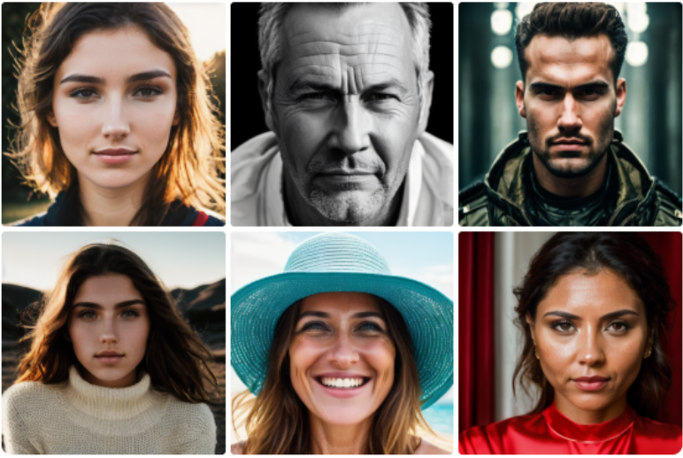

### SD-tiny model LoRA trained on abstract images

Below are some of the images generated with the LoRA trained sd-tiny model, on abstract concepts0.

Link to the model -> [Huggingface 🤗 repo](https://huggingface.co/segmind/tiny_lora_mxtun3_style)


## Speed comparision of inference on NVIDIA A100 80GB:

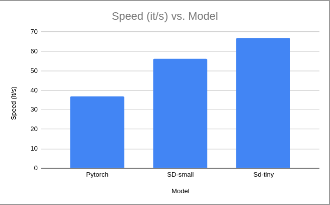


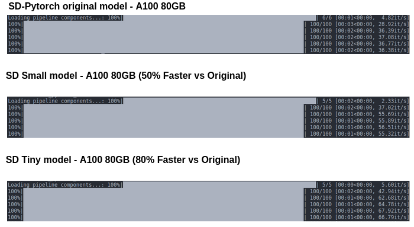

## Advantages
+ Upto 100% Faster inferences
+ Upto 30% lower VRAM footprint
+ Faster dreambooth and LoRA training

## Limitations
+ The distilled models are in early phase and the outputs may not be at a production quality yet.
+ These models may not be the best general models. They are best used as fine-tuned or LoRA trained on specific concepts/styles.
+ Distilled models are not very good at composibility or multiconcepts yet.

## Research Roadmap
- [ ] SDXL distilled models and code.
- [ ] Further fine-tuned SD-1.5 base models for better composibility and generalization.
- [ ] Apply Flash Attention-2 for faster training/fine-tuning
- [ ] Apply TensorRT and/or AITemplate for further accelerations.
- [ ] Look at Quantization-Aware-Training(QAT) during distillation process.

## Acknowledgements:

+ This work would not have been possible without Nota AI's [paper](https://arxiv.org/pdf/2305.15798.pdf) on compression models. We express our gratitude for their research work in this area.

## Contributors:
<a href="https://github.com/segmind/distill-sd/graphs/contributors">
  
</a>

Made with [contrib.rocks](https://contrib.rocks).
  


## Citation

```bibtex
@article{kim2023architectural,
  title={On Architectural Compression of Text-to-Image Diffusion Models},
  author={Kim, Bo-Kyeong and Song, Hyoung-Kyu and Castells, Thibault and Choi, Shinkook},
  journal={arXiv preprint arXiv:2305.15798},
  year={2023},
  url={https://arxiv.org/abs/2305.15798}
}
```
```bibtex
@article{Kim_2023_ICMLW,
  title={BK-SDM: Architecturally Compressed Stable Diffusion for Efficient Text-to-Image Generation},
  author={Kim, Bo-Kyeong and Song, Hyoung-Kyu and Castells, Thibault and Choi, Shinkook},
  journal={ICML Workshop on Efficient Systems for Foundation Models (ES-FoMo)},
  year={2023},
  url={https://openreview.net/forum?id=bOVydU0XKC}
}
```

